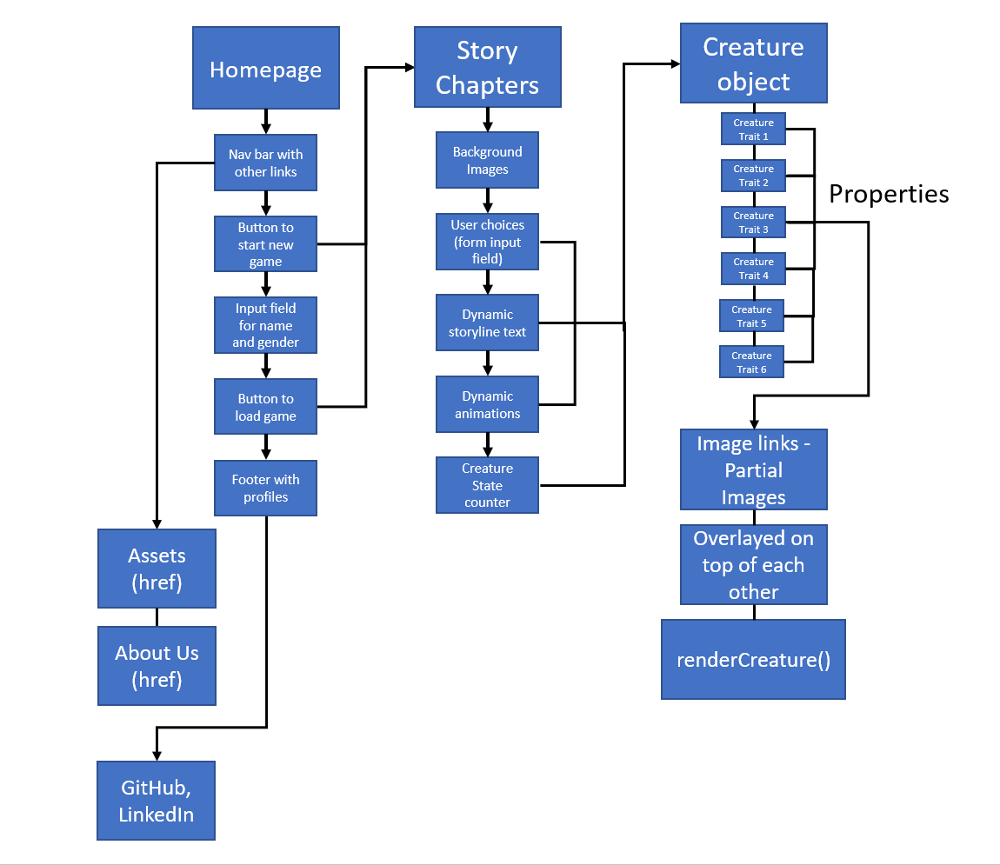

# Creature of Pleiades

This is Team Drax's Code 201 final project repo.

## ***Team Drax*** Members

- Haustin Kimbrough
- Abdulkadir Sheikh
- Justin Hamerly
- Christopher Burk

- The Creature of Pleiades is a choose your own adventure game/story mode that follows the user/protagonist through their finding a "creature" that they must care for and protect. The user chooses options and determines their own "path" and "ending". It is a fun, shared-experience game for the user to experience level-progression, interactive content, unique character development through a campaign-style story mode.

- The MVP should include at least three "different" outcomes based on user input/experience.

## **User Stories**

### *As a user, I want an interactive game, so that the game is fun and engaging.*

- creature development
- fun story
- multiple endings

### *As a user, I want to be able to continue my game, so that I don't have to start at the beginning*

- save data to local storage after each choice in the game
- a continue button to continue from where the user left off if they leave the page or on the home page
- an option to reset the game

### *As a user, I want customization, so my game feels personal to me*

- take in user info name of protagonist (user), name of creature
- 5 choices in the game influencing creature
- background color toggle for user's color choice.

### *As a user, I want multiple outcomes, so my game has replay value.*

- 5 endings - 1 neutral, 1 perfect, 1 worst, 1 positive, 1 negative

### *As a user, I want a clean interface, so my game is easy to understand and casual.*

- obvious buttons/menus
- a layout that isn't overly complicated/not a lot of menus

## Domain Modeling

Book resources used for project:

[Jon Duckett, HTML & CSS, John Wiley & Sons, Inc., ©2011](http://www.htmlandcssbook.com/)

[Jon Duckett, JavaScript & JQuery, John Wiley & Sons, Inc., ©2014](http://javascriptbook.com/)

Online resources used for project:

[MDN Web Docs](https://developer.mozilla.org/en-US/)

[w3schools](https://www.w3schools.com/)

[css-tricks](https://css-tricks.com/)

Images

[Unsplash](https://unsplash.com/photos/7Ym9rpYtSdA)

- [Pleiades home screen text box image](https://images.unsplash.com/photo-1501862700950-18382cd41497?ixid=MnwxMjA3fDB8MHxwaG90by1wYWdlfHx8fGVufDB8fHx8&ixlib=rb-1.2.1&auto=format&fit=crop&w=894&q=80)

[Unsplash](https://unsplash.com/photos/pVdiv_8oY_s)

- [Pleiades home screen center image](https://images.unsplash.com/photo-1499343162160-cd1441923dd3?ixlib=rb-1.2.1&ixid=MnwxMjA3fDB8MHxwaG90by1wYWdlfHx8fGVufDB8fHx8&auto=format&fit=crop&w=1050&q=80)

Custom Google Font

- [Kaushan Script](https://fonts.google.com/specimen/Kaushan+Script?category=Handwriting&slant=7#standard-styles)

Reset CSS

[CSS reset](https://meyerweb.com/eric/tools/css/reset/)

[CSS transforms](https://learn.shayhowe.com/advanced-html-css/css-transforms/)

[HTML scroll box](https://www.quackit.com/html/codes/html_scroll_box.cfm)

[Grow rotate button](https://codepen.io/techshiva/pen/YMpwKg)

[Glowing buttons](https://codepen.io/jpost-design/pen/EKZLzK)

[CSS animations](https://www.w3schools.com/css/css3_animations.asp)

[HTML JavaScript scripts](https://www.w3schools.com/html/html_scripts.asp)

[CSS positioning](https://www.w3schools.com/css/css_positioning.asp)

[CSS transitions](https://www.w3schools.com/css/css3_transitions.asp)

[CSS keyframes animations](https://www.w3schools.com/cssref/css3_pr_animation-keyframes.asp)

[HTML links](https://www.w3schools.com/html/html_links.asp)

[Colors](https://www.w3schools.com/colors/color_tryit.asp?hex=8B008B)

[JavaScript vertical tabs](https://www.w3schools.com/howto/howto_js_vertical_tabs.asp)

[CSS shake things!](https://www.w3schools.com/howto/howto_css_shake_image.asp)

[CSS overflow](https://www.w3schools.com/cssref/css3_pr_overflow-y.asp)

[CSS filters](https://css-tricks.com/almanac/properties/f/filter/)

[Complete Guide to Flexbox](https://css-tricks.com/snippets/css/a-guide-to-flexbox/#:~:text=A%20flex%20container%20expands%20items,which%20is%20horizontally%2Dbased)

[href buttons](https://css-tricks.com/forums/topic/adding-href-to-button/)
